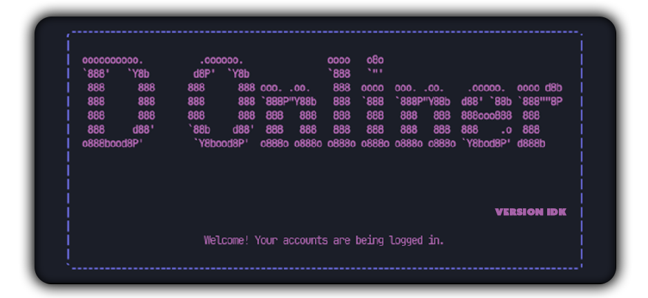

<link rel="preconnect" href="https://fonts.googleapis.com">
<link rel="preconnect" href="https://fonts.gstatic.com" crossorigin>
<link href="https://fonts.googleapis.com/css2?family=Spicy+Rice&display=swap" rel="stylesheet">
<center>
<strong><h1 style='font-size: 4.5rem; color:purple; font-family: "Spicy Rice", serif; font-weight: 400;'>D-Onliner</h1></strong>

</center>


## What is D-Onliner?
D-Onliner is a Discord account onliner tool that keeps your account(s) online as long as the program is running. It allows you to log in using **more than one token**.


## Getting Started with D-Onliner 🏗

### Step 1: Setup
To get started, make sure you have the following installed on your machine:
- [Node.js](https://nodejs.org/en)
- [pnpm](https://pnpm.io) ( That's the one is use )

Then, clone the repository or download the source code:
```bash
clone https://github.com/Demon-X14/D-Onliner
cd D-Onliner
```**

### Step 2: Install Dependencies
Navigate to the project directory in your terminal and install the required dependencies using one of the following commands:
```javascript
pnpm i
```
### or
```javascript
npm i
```

### Step 3: Prepare the Tokens File
Rename the `RENAME THIS TO tokens.txt` file in the `config` directory to `tokens.txt`. This file is used to store your Discord tokens.

### Step 4: Run the Application
Start the application by running one of the following commands:
```
pnpm start
```
### OR
```
npm start
```
If you haven't provided any tokens yet, the application will prompt you to enter your token(s) separated by commas.

### Step 5: Logging In
Once you enter your tokens, the application will log in to Discord using each token you provided and keep the accounts online.

## Super Command
```bash
clone https://github.com/Demon-X14/D-Onliner
cd D-Onliner
pnpm i
pnpm start
```

## Important Notes
- ### **THIS APP IS AGAINST DISCORD TERMS OF SERVICE AND CAN GET YOUR ACCOUNT(S) BANNED.**
- ###  Please check for updates regularly to ensure you are using the latest version of **D-Onliner**.
- Keep your tokens **secure** and do not share them with anyone, as they provide access to your Discord account(s).
- **D-Onliner** is intended for personal use only and should not be used for malicious purposes, as it may violate Discord's terms of service.
